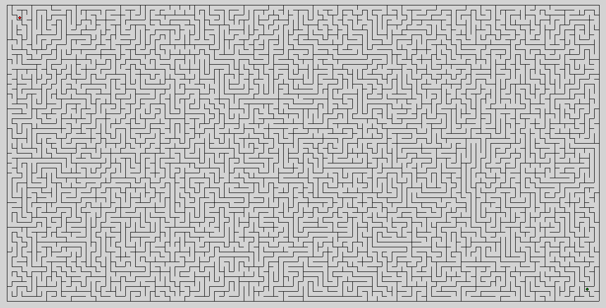
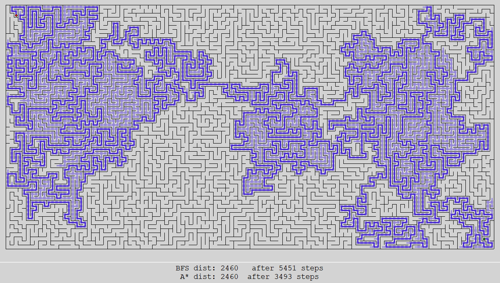

# Mazes and Maze Exploration
Python script that creates mazes of custom sizes and runs common exploration algorithms through them, with graphical animations.

## Notes
Uses DFS to create a 'perfect maze'.
Such that the paths of the maze form a tree (there is only 1 possible path between any two points in the maze).

Requires contents of `support.py`.

## To run
Run `mazesystem.py`.

## Samples

