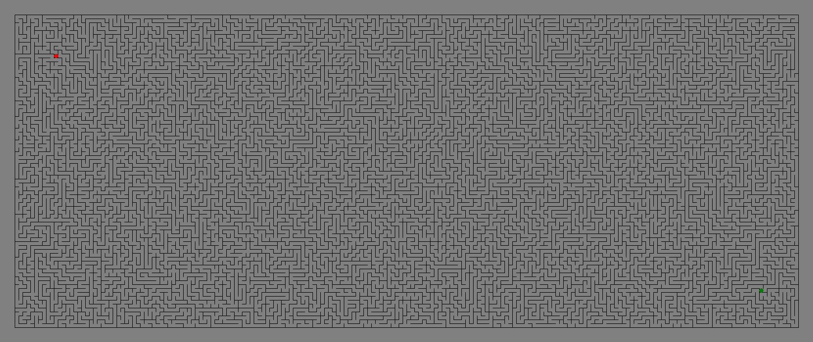
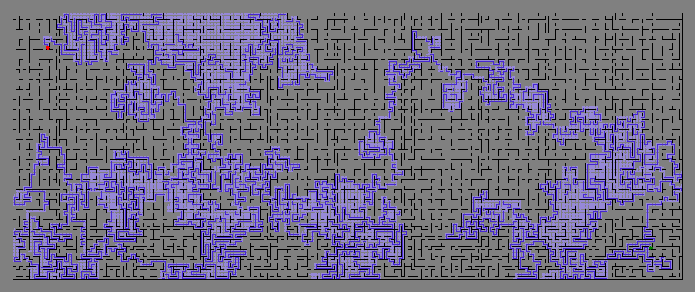
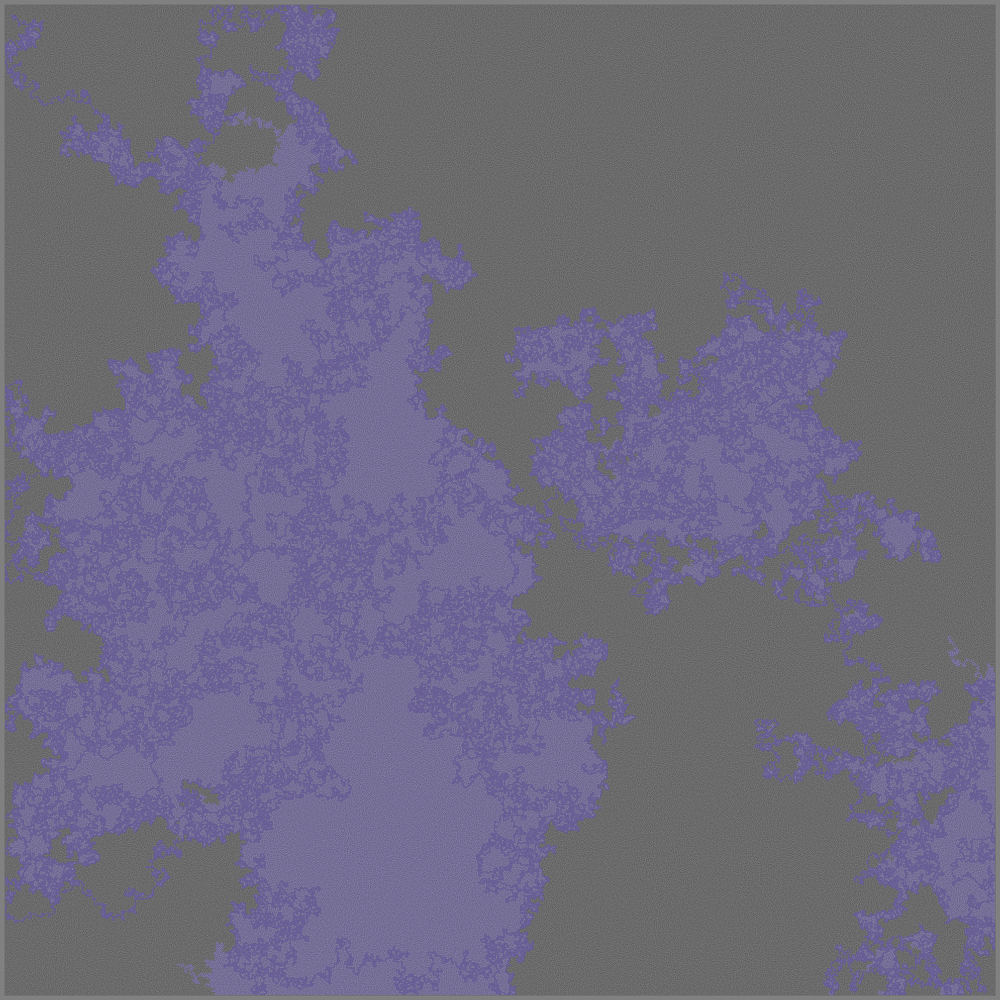
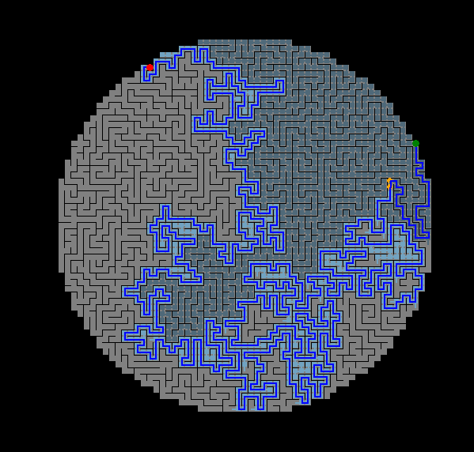

# Mazes and Maze Exploration
Python script that creates mazes of custom sizes and runs common exploration algorithms through them, with graphical animations.

## Notes
Uses DFS to create a 'perfect maze'.
Such that the paths of the maze form a tree (there is only 1 possible path between any two points in the maze).

Requires contents of `support.py`.

## Versions
`mazesystem.py` uses tkinker canvas items to render (much slower)
`mazesystem img.py` uses PIL to render images (much much faster).

## Use as modules
All functionality is coded as class items in the .py files and may be imported to any python file and used.
Includes maze, graphic, walls, and navigation class items.

## Samples

Generated Maze

Aforementioned maze, solved using A*

Very big maze (1k by 1k) solved with A*

Circular maze